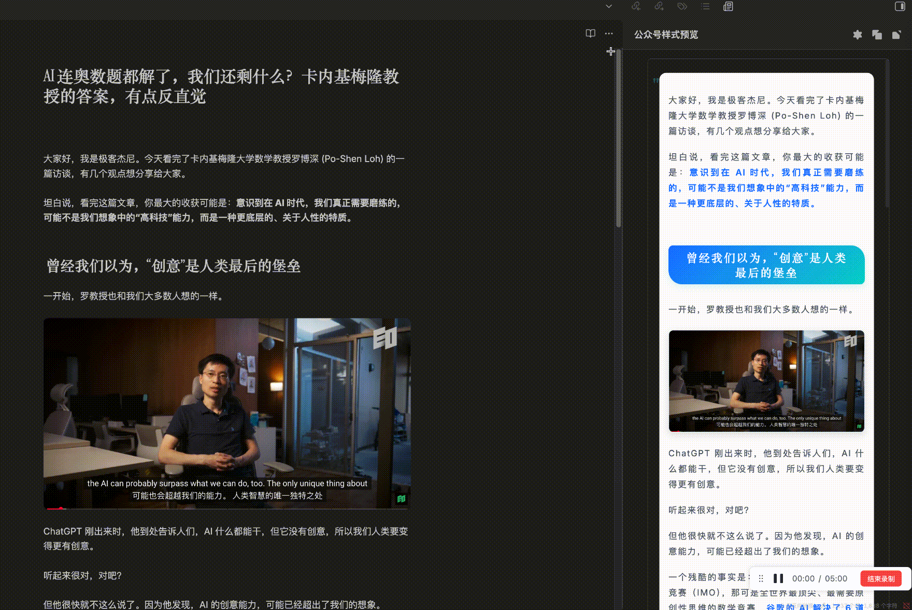
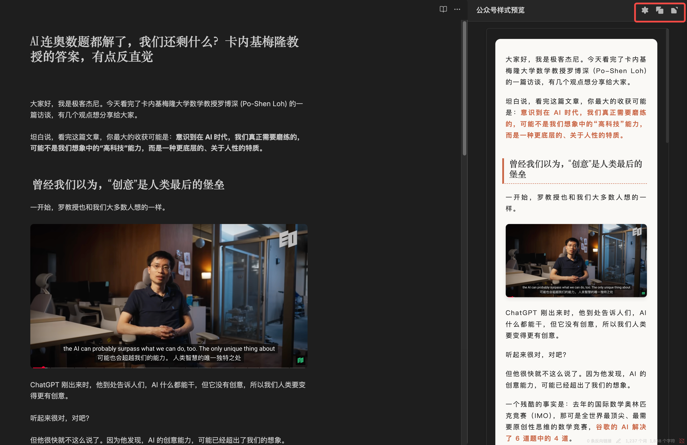
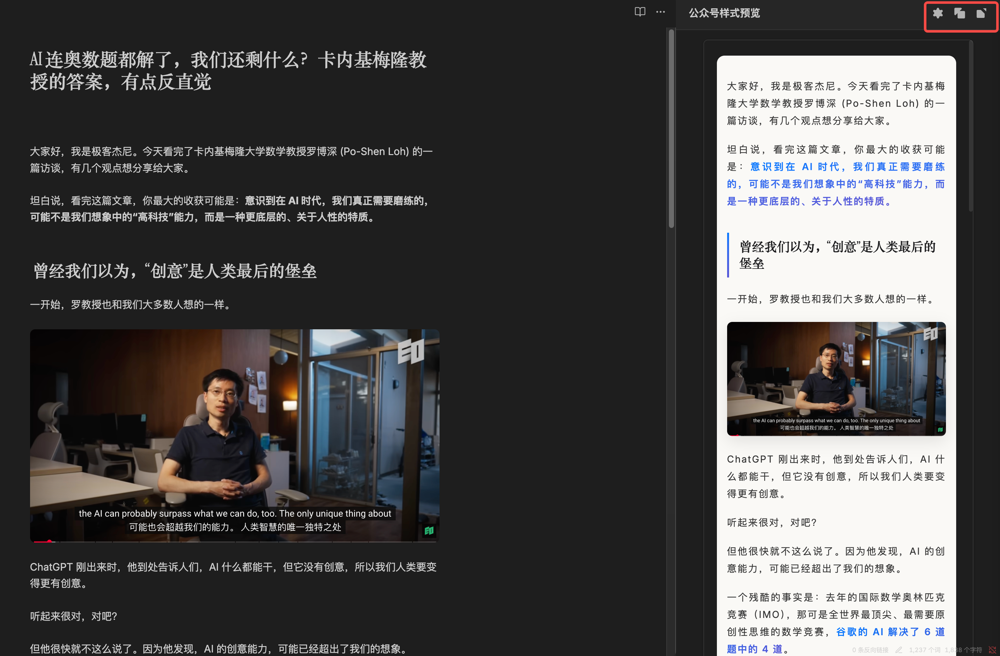
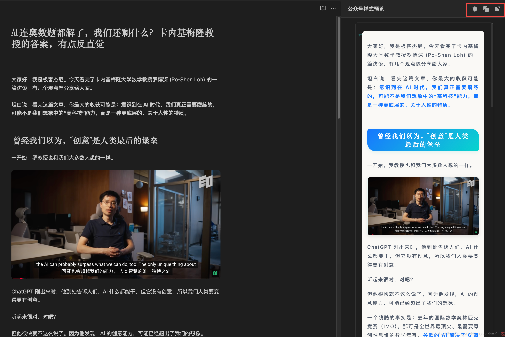

# 公众号排版助手 Obsidian 插件

> **一键将 Markdown 转换为微信公众号样式**

这是一个专为 Obsidian 用户设计的插件，基于 [极简美学排版神器](https://www.md2wechat.cn) 强大的 API 服务，可以轻松将 Markdown 文档转换为适合微信公众号发布的样式化 HTML 内容。

<div align="center">




</div>

## ✨ 特性

- 🚀 **一键转换**: 通过功能区按钮或命令面板快速转换
- 🎨 **多种主题**: 支持多种预设主题样式
- 📝 **实时预览**: 右侧窗口实时展示转换效果
- ⚡ **智能样式切换**: 预览窗口内直接切换主题和字体大小，无需重新打开文件
- ⚙️ **灵活配置**: 抽屉式设置面板，极简化操作体验
- 🔄 **即时同步**: 修改后立即可重新转换预览
- 📱 **全平台**: 支持桌面和移动端 Obsidian
- 🛡️ **错误处理**: 完善的异常提示和用户反馈

## 📸 预览

### 🎨 主题样式展示

我们提供多种精美主题，满足不同的公众号风格需求：

<div align="center">

<table>
<tr>
<td align="center" width="50%">

**🌟 默认温暖风**<br>
*温馨舒适，适合日常内容*



</td>
<td align="center" width="50%">

**🍎 苹果风**<br>
*极简优雅，设计感突出*



</td>
</tr>
<tr>
<td align="center" width="50%">

**🔷 字节范**<br>
*简洁现代，科技感强*



</td>
<td align="center" width="50%">

**🌌 赛博朋克**<br>
*未来科幻，个性十足*


</td>
</tr>
</table>

</div>

### ⚡ 智能样式切换

现在你可以在预览窗口中**实时切换主题和字体大小**：

```
转换文档 → 点击设置图标 ⚙️ → 选择新主题 → 立即看到效果 ✨
```

无需重新打开文件，无需重复操作，一键切换，即时生效！

## 🚀 快速开始

### 1. 安装插件

详细安装说明请查看 [INSTALL.md](INSTALL.md)

**快速安装**:
1. 下载最新 [Release](https://github.com/geekjourneyx/obsidian-md2wechat/releases)
2. 解压到 `.obsidian/plugins/obsidian-md2wechat/` 
3. 重启 Obsidian 并在设置中启用插件

### 2. 配置设置

1. 访问 [极简美学排版神器](https://www.md2wechat.cn) 官网获取 API Key
2. 在插件设置中填写配置信息

### 3. 开始使用

1. 打开任意 Markdown 文件
2. 点击功能区的 📰 图标或使用命令 `一键排版到公众号样式`
3. 右侧预览窗口查看效果，复制内容到微信公众号

## 🛠️ 开发

### 环境要求

- Node.js >= 16
- npm 或 yarn
- Obsidian >= 0.15.0

### 本地开发

```bash
# 克隆仓库
git clone https://github.com/geekjourneyx/obsidian-md2wechat.git

# 安装依赖
npm install

# 开发模式（自动编译）
npm run dev

# 生产构建
npm run build
```

### 项目结构

```
├── main.ts           # 插件主逻辑
├── settings.ts       # 设置管理
├── view.ts           # 预览视图
├── manifest.json     # 插件清单
├── styles.css        # 样式文件
├── CLAUDE.md         # Claude Code 开发指引
├── INSTALL.md        # 详细安装说明
└── dev.md           # 开发指导文档
```

## 📋 使用指南

### 基本操作

| 操作 | 方法 |
|------|------|
| 转换当前文档 | 点击功能区 📰 图标 |
| 命令面板调用 | `Ctrl/Cmd + P` → "一键排版到公众号样式" |
| 预览转换结果 | 查看右侧预览窗口 |
| 复制内容 | 右键预览内容 → 复制 |

### 配置选项

| 设置项 | 说明 | 示例 |
|--------|------|------|
| API Key | 极简美学排版神器的访问密钥 | `wme_xxx...` |
| 主题名称 | 排版主题样式 | 见下方支持主题列表 |
| 字号大小 | 文字显示大小 | 小号/中等/大号 |

### 🎨 支持主题

| 主题名称 | 主题标识 | 风格特点 |
|---------|---------|---------|
| 默认温暖风 | `default` | 温馨舒适，适合日常内容 |
| 字节范 | `bytedance` | 简洁现代，科技感强 |
| 苹果风 | `apple` | 极简优雅，设计感突出 |  
| 运动风 | `sports` | 活力动感，适合健身运动 |
| 中国风 | `chinese` | 古典雅致，传统文化 |
| 赛博朋克 | `cyber` | 未来科幻，个性十足 |

## 🚀 服务级别

### 🆓 免费版本 (当前插件)
本插件使用基础转换服务，支持 Markdown 转 HTML：

```typescript
const response = await fetch('https://www.md2wechat.cn/api/convert', {
  method: 'POST',
  headers: {
    'Content-Type': 'application/json',
    'X-API-Key': 'wme_your_api_key_here'
  },
  body: JSON.stringify({
    markdown: '# 标题\n\n这是一个**加粗**文本的例子。',
    theme: 'default',
    fontSize: 'medium'
  })
});
```

### 💎 高级 API 服务 - 一站式解决方案

<div align="center">

**🔥 直接创建微信公众号草稿，告别复制粘贴！**

[](https://www.md2wechat.cn/api-docs)

</div>

**🌟 高级版特色功能:**
- ✨ **Markdown 转换**: 支持全部 6 种精美主题
- 🚀 **自动创建草稿**: 直接在微信公众号后台创建草稿
- ⚡ **一键发布流程**: 转换完成即可进入发布界面
- 🎨 **更多主题选择**: 解锁全部主题样式
- 🔧 **高级定制**: 支持更多个性化配置

**💼 适用场景:**
- 📝 **专业内容创作者**: 提升发布效率
- 🏢 **团队协作**: 批量内容管理
- ⚡ **高频发布**: 每日多篇内容输出
- 🎯 **营销推广**: 专业品牌形象

> 💡 **提升效率 80%**: 从写作到发布，一个 API 搞定！

## ❓ 常见问题

### 插件相关

**Q: 插件安装后不显示？**
- 确保文件放在正确的目录 `.obsidian/plugins/md2wechat-publisher/`
- 重启 Obsidian 并在设置中启用插件

**Q: 提示 API Key 错误？**
- 检查 API Key 是否正确填写
- 确认 md2wechat.cn 账户状态正常

### 功能相关

**Q: 某些 Markdown 语法不支持？**
- 插件支持标准 Markdown 语法
- 部分特殊语法可能需要 API 服务支持

**Q: 如何自定义样式？**
- 免费版本支持基础主题调整
- 高级版本支持全部 6 种精美主题和更多定制选项
- 查看 [API 文档](https://www.md2wechat.cn/api-docs) 了解高级功能

**Q: 能否直接发布到微信公众号？**
- 当前插件支持转换和预览，需手动复制粘贴
- 🚀 **高级 API 服务**支持直接创建公众号草稿，一键进入发布流程
- 适合专业创作者和高频发布场景

**Q: 与免费版本有什么区别？**
- **免费版**: Markdown 转 HTML，手动复制粘贴
- **高级版**: 一站式解决方案，自动创建草稿 + 发布流程
- **详细对比**: 访问 [官网](https://www.md2wechat.cn) 了解服务差异

## 🤝 贡献

欢迎提交 Issue 和 Pull Request！

1. Fork 本仓库
2. 创建功能分支 (`git checkout -b feature/AmazingFeature`)
3. 提交更改 (`git commit -m 'Add some AmazingFeature'`)
4. 推送分支 (`git push origin feature/AmazingFeature`)
5. 开启 Pull Request

## 📄 许可证

本项目采用 [MIT 许可证](LICENSE)。

## 🙏 致谢

- [Obsidian](https://obsidian.md) - 优秀的知识管理工具
- [极简美学排版神器](https://www.md2wechat.cn) - 提供强大的转换 API 服务
- Obsidian 社区的所有贡献者

## Star History

[](https://www.star-history.com/#geekjourneyx/obsidian-md2wechat&Date)

## 📞 联系与交流

### 👨‍💻 作者信息
- **作者**: geekjourneyx
- **博客**: [https://www.geeki.cc](https://www.geeki.cc)
- **项目地址**: [GitHub](https://github.com/geekjourneyx/obsidian-md2wechat)

### 🌟 加入社区

<div align="center">

**📱 关注公众号「极客杰尼」，加入产品交流群**


扫描二维码关注公众号，回复「交流群」加入产品交流群

**🎯 社区福利:**
- 🔥 第一时间获取产品最新动态
- 👥 与优秀的 AI 创作者们学习交流  
- 💡 分享创作技巧和使用心得
- 🎁 获取独家资源和福利
- 💎 **高级服务咨询** - 专业版本介绍和使用指导

</div>

### 📋 问题反馈
- **Bug 报告**: [创建 Issue](https://github.com/geekjourneyx/obsidian-md2wechat/issues)
- **功能建议**: [讨论区](https://github.com/geekjourneyx/obsidian-md2wechat/discussions)

---

<div align="center">

**⭐ 如果这个项目对你有帮助，请给一个 Star！**

---

### 🌟 产品生态

<table>
<tr>
<td align="center" width="50%">

**🆓 免费插件版**<br>
*当前项目*

- ✅ Markdown 转 HTML  
- ✅ 6 种主题选择
- ✅ 本地预览复制
- ✅ 完全开源免费

[📥 下载插件](https://github.com/geekjourneyx/obsidian-md2wechat/releases)

</td>
<td align="center" width="50%">

**💎 高级 API 版**<br>
*一站式解决方案*

- 🚀 直接创建公众号草稿
- ⚡ 一键进入发布流程  
- 🎨 更多高级定制选项
- 💼 企业级服务支持

[🔥 了解高级版](https://www.md2wechat.cn/api-docs)

</td>
</tr>
</table>

**🔗 官方网站**: [极简美学排版神器](https://www.md2wechat.cn)

</div>
